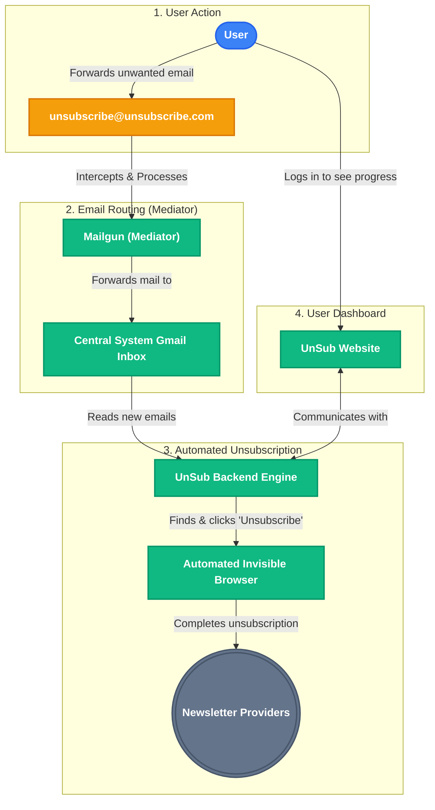

# UnSub - Technical Architecture & Stack Documentation

## 1. Executive Summary
The UnSub project is a modern web application designed to help users manage and automate email unsubscriptions. It utilizes a decoupled architecture featuring a highly interactive React-based frontend and a robust Python-based backend. The system integrates deeply with Google Workspace APIs for email management and employs headless browser automation to handle complex unsubscription flows.

## 2. Frontend Architecture
The frontend is built for high performance, SEO, and fluid user experiences.

*   **Core Framework:** **Next.js (v16.2)** utilizing the App Router.
*   **UI Library:** **React (v19)** with React DOM.
*   **Language:** **TypeScript (v5)** for strict type safety and enhanced developer experience.
*   **Styling Engine:** **Tailwind CSS (v4)** with PostCSS integration for utility-first, responsive design.
*   **Animations & Interactions:**
    *   **GSAP (GreenSock):** Used for advanced, timeline-based animations.
    *   **Lenis:** Provides smooth scrolling experiences.
    *   **Lottie React:** For rendering lightweight vector animations.

## 3. Backend Architecture
The backend is a RESTful service designed to handle OAuth flows, background tasks, and API requests from the frontend.

*   **Web Framework:** **Flask (v3.1.3)** in Python.
*   **Production Server:** **Gunicorn (v23.0.0)** WSGI HTTP Server.
*   **Email Processing & Automation:**
    *   **Mailgun:** Acts as the central mediator for email routing. When a user forwards an email to `unsubscribe@unsubscribe.com`, Mailgun intercepts it and forwards it directly to the system's central Gmail inbox for processing.
    *   **Google API Python Client:** To interact with the Gmail API for reading email headers and managing inbox state.
    *   **Playwright (v1.61):** Headless browser automation engine used to navigate and execute JavaScript-heavy unsubscribe links automatically.
    *   **BeautifulSoup4 (v4.15):** Used for parsing HTML payloads and extracting unsubscription links from email bodies.
*   **Concurrency:** Python threading is used for background task execution (e.g., the `unsubscribe_engine`).

## 4. Database & Authentication
Data persistence and user management are handled via a BaaS (Backend-as-a-Service) model.

*   **Database:** **Supabase (PostgreSQL)**. The backend communicates with Supabase via its REST API (using the `requests` library) rather than a direct database connection, ensuring statelessness and scalability.
*   **Authentication & Security:**
    *   **Google OAuth2:** Integrated using `google-auth` and `google-auth-oauthlib` for secure user consent and token generation.
    *   **Custom Authentication:** Email and password-based authentication stored securely in Supabase.
    *   **Token Management:** OAuth tokens are persisted securely across the environment variables, local filesystem, and Supabase database to ensure background workers can operate uninterrupted.

## 5. DevOps & Deployment
*   **Containerization:** **Docker** is used for containerizing the backend service (indicated by the presence of a `Dockerfile` and `build.sh`).
*   **Environment Configuration:** Managed via `.env` files and `python-dotenv`.
*   **Package Management:** `npm` for frontend dependencies and `pip` (`requirements.txt`) for backend dependencies.

## 6. System Architecture Diagram

The following diagram illustrates how the UnSub platform works from a high-level, designed to be easily understood by non-technical audiences.

